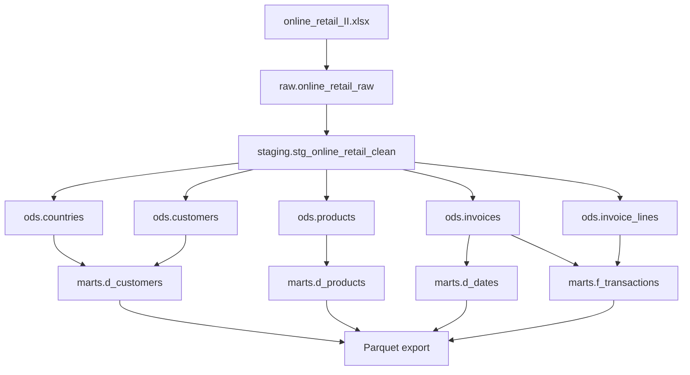

# Лабораторная работа 1. Сырые данные -> витрина аналитики

Проект строит аналитическую витрину по датасету `online_retail_II.xlsx`: транзакции интернет-магазина за 2009-2011 годы.

## Структура проекта

```text
.
|-- online_retail_II.xlsx
|-- docker-compose.yml
|-- requirements.txt
|-- scripts/
|   |-- load_raw.py
|   |-- run_sql.py
|   |-- export_marts_to_parquet.py
|   |-- build_local_parquet_preview.py
|   `-- profile_source.py
`-- sql/
    |-- staging/
    |   `-- stg_online_retail.sql
    |-- ods/
    |   `-- ods_retail.sql
    `-- marts/
        |-- marts_retail.sql
        `-- metrics.sql
```

## Лабораторная работа 2: запуск через Airflow

В проект добавлен Airflow-стек:

- `Dockerfile` - образ Airflow с Python-зависимостями проекта;
- `docker-compose.yaml` - Airflow webserver/scheduler/dag-processor/triggerer, Postgres для метаданных Airflow и отдельный `warehouse-postgres` для аналитической БД;
- `dags/ecommerce_retail_pipeline.py` - DAG, который выполняет существующий ETL: профилирование источника, загрузку raw, построение SQL-слоев и экспорт marts в Parquet.

Запуск:

```bash
docker compose -f docker-compose.yaml up airflow-init
docker compose -f docker-compose.yaml up -d
```

Выключить:
```bash
docker compose -f docker-compose.yaml down
```

Airflow UI:

- URL: `http://localhost:8080`
- login: `admin`
- password: `admin`

В интерфейсе нужно запустить DAG `ecommerce_retail_analytics_pipeline`.

Хранилище витрин доступно внутри Docker-сети как `warehouse-postgres:5432`, а с хоста как `localhost:5433`.

## Запуск

1. Установить зависимости:

```bash
python -m pip install -r requirements.txt
```

2. Поднять Postgres:

```bash
docker compose up -d
```

3. Загрузить сырой Excel в схему `raw`:

```bash
python scripts/load_raw.py
```

4. Выполнить SQL-пайплайн `staging -> ods -> marts`:

```bash
python scripts/run_sql.py
```

5. Выгрузить витрину в Parquet:

```bash
python scripts/export_marts_to_parquet.py
```

Если Docker/Postgres недоступен, для проверки размера Parquet можно выполнить локальную сборку витрины из Excel:

```bash
python scripts/build_local_parquet_preview.py
```

## Источник данных

Файл: `online_retail_II.xlsx`.

| Лист | Строк | Полных дублей | Пропусков Customer ID | Пропусков Description | Минимальная дата | Максимальная дата |
|:--|--:|--:|--:|--:|:--|:--|
| Year 2009-2010 | 525461 | 6865 | 107927 | 2928 | 2009-12-01 07:45:00 | 2010-12-09 20:01:00 |
| Year 2010-2011 | 541910 | 5268 | 135080 | 1454 | 2010-12-01 08:26:00 | 2011-12-09 12:50:00 |

Исходные поля:

| Поле | Описание |
|:--|:--|
| `Invoice` | номер счета/заказа |
| `StockCode` | код товара |
| `Description` | описание товара |
| `Quantity` | количество товара |
| `InvoiceDate` | дата и время счета |
| `Price` | цена единицы товара |
| `Customer ID` | идентификатор клиента |
| `Country` | страна клиента |

## Очистка данных

Очистка выполняется SQL-запросом `sql/staging/stg_online_retail.sql`.

Принятые правила:

- `Invoice`, `StockCode`, `Description`, `Quantity`, `InvoiceDate`, `Price`, `Customer ID`, `Country` считаются обязательными.
- Полные дубликаты строк удаляются через `row_number()` по бизнес-полям.
- Типы приводятся к `text`, `integer`, `numeric(12, 4)`, `timestamp`.
- Записи с `quantity <= 0` и `unit_price <= 0` исключаются как возвраты, отмены и технические корректировки.
- Записи с датой раньше `2000-01-01` исключаются.
- Если один `Customer ID` встречается в нескольких странах, в ODS выбирается каноническая страна клиента: самая частая, а при равенстве - страна из самой поздней покупки.

## ODS-слой

Схема: `ods`. Данные нормализованы до 3НФ.

| Таблица | Назначение | Первичный ключ |
|:--|:--|:--|
| `ods.countries` | страны клиентов | `country_id` |
| `ods.customers` | клиенты и ссылка на страну | `customer_id` |
| `ods.products` | товары | `product_id` |
| `ods.invoices` | счета/заказы | `invoice_no` |
| `ods.invoice_lines` | строки счетов | `invoice_line_id` |

Во все таблицы добавлены технические поля:

- `_loaded_at` - дата и время загрузки строки;
- `_source_file` - имя файла-источника.

Ограничения БД:

- `NOT NULL` на обязательных полях;
- `PRIMARY KEY` и `UNIQUE` для ключей измерений;
- `FOREIGN KEY` между сущностями;
- `CHECK` для положительных количеств, цен, выручки и диапазона дат.

## Витрина marts

Схема: `marts`.

| Таблица | Тип | Назначение |
|:--|:--|:--|
| `marts.d_dates` | измерение | календарь по датам транзакций |
| `marts.d_customers` | измерение | клиенты, страна, дата первой покупки |
| `marts.d_products` | измерение | товары |
| `marts.f_transactions` | факт | строки продаж с количеством, ценой и выручкой |

Факт `marts.f_transactions` ссылается внешними ключами на `d_dates`, `d_customers`, `d_products`.

## Бизнес-метрики

SQL-запросы находятся в `sql/marts/metrics.sql`.

Рассчитываются:

- `revenue` - сумма `f_transactions.revenue` за месяц;
- `arpu` - выручка месяца / количество активных клиентов месяца;
- `new_customers` - количество клиентов, у которых первая покупка пришлась на период;
- `retention` - упрощенная доля активных клиентов месяца, у которых первая покупка была раньше этого месяца.

## Экспорт Parquet

Основной экспорт из Postgres выполняет `scripts/export_marts_to_parquet.py` и сохраняет файлы в `exports/parquet/`.

| Файл | Строк | Размер |
|:--|--:|:--|
| `online_retail_II.xlsx` | 1067371 | 43.51 MB |
| `exports/parquet/d_dates.parquet` | 739 | 15.62 KB |
| `exports/parquet/d_customers.parquet` | 5878 | 48.83 KB |
| `exports/parquet/d_products.parquet` | 4631 | 123.72 KB |
| `exports/parquet/f_transactions.parquet` | 779421 | 7.57 MB |

Parquet меньше исходного файла, потому что хранит данные по колонкам и эффективно сжимает повторяющиеся значения. Для аналитических запросов это особенно полезно: можно читать только нужные колонки, не сканируя всю строковую запись целиком.

## Lineage


